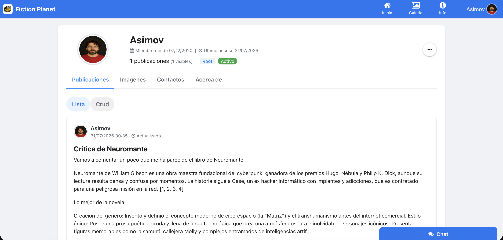
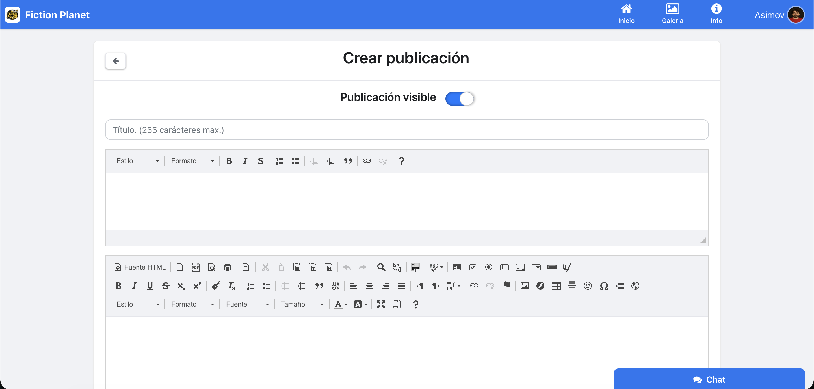
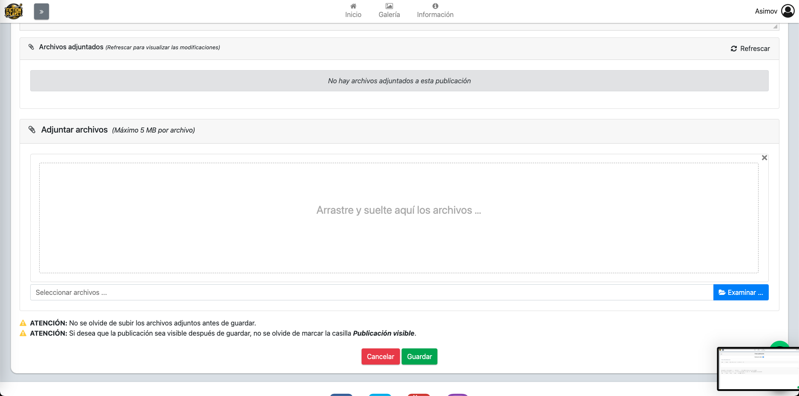

# 🌎 FictionPlanet-Web


## 📋 Índice
- [Descripción del Proyecto](#-descripción-del-proyecto)
- [Aspectos Técnicos](#-aspectos-técnicos)
- [Funcionalidades](#-funcionalidades)
- [Estructura del Proyecto](#-estructura-del-proyecto)
- [Modelo de Datos](#-modelo-de-datos)
- [Requisitos del Sistema](#-requisitos-del-sistema)
- [Instalación](#-instalación)
- [Configuración](#-configuración)
- [Capturas de Pantalla](#-capturas-de-pantalla)
- [Seguridad Implementada](#-seguridad-implementada)

## 🚀 Descripción del Proyecto

FictionPlanet es una aplicación web que simula una red social completa, desarrollada con propósitos didácticos y educativos. El proyecto demuestra la implementación de un sistema web completo con arquitectura MVC (Modelo-Vista-Controlador) y patrón DAO (Data Access Object) en PHP. 

Esta página web no está siendo utilizada para ningún objetivo comercial, y surge únicamente como proyecto personal y como ejemplo de las capacidades adquiridas. Tanto el nombre como el logo son elementos provisionales, así como algunos ejemplos para rellenar texto o diversas imágenes.

## 💻 Aspectos Técnicos

La aplicación ha sido diseñada siguiendo principios robustos de ingeniería de software:

- **Arquitectura MVC**: Implementación completa del patrón Modelo-Vista-Controlador para separar la lógica de negocio de su visualización.
  - **Controladores**: Clases PHP que reciben las peticiones HTTP desde el Front Controller (index.php), extraen parámetros de la URL, validan permisos de usuario y orquestan la ejecución de la lógica de negocio.
    - Cada controlador hereda de la clase base `Controller` que proporciona funcionalidades comunes
    - Se instancian dinámicamente según la URL solicitada (ej: `/users/profile` invoca `Users::profile()`)
    - Preparan datos para las vistas a través de arrays asociativos
  
  - **Modelos**: Implementan entidades del negocio como clases PHP con propiedades privadas y métodos getter/setter.
    - Representan objetos del dominio (Usuario, Publicación, Mensaje, etc.)
    - Encapsulan la lógica de validación específica de entidades
    - Proporcionan independencia de la capa de persistencia
  
  - **Vistas**: Archivos PHP con HTML que reciben datos procesados de los controladores.
    - Utilizan plantillas reutilizables para elementos comunes (header, footer, modales)
    - Incorporan scripts JavaScript para funcionalidades dinámicas
    - Se renderizan a través del método `render()` de la clase `View`

- **Sistema de Enrutamiento**: Implementación del patrón Front Controller para gestionar todas las peticiones HTTP:
  - **Componentes principales**:
    - `index.php`: Front Controller que inicia la aplicación
    - `App.php`: Analizador de URL y despachador de controladores
    - `.htaccess`: Configuración de Apache para redireccionar peticiones
  
  - **Funcionamiento del enrutador**:
    1. Todas las peticiones son redirigidas a `index.php` mediante reglas en `.htaccess`
    2. El Front Controller carga la configuración y crea una instancia de `App`
    3. `App.php` analiza la URL siguiendo la estructura `/controlador/metodo/parametros`
    4. Extrae el nombre del controlador y lo convierte en CamelCase
    5. Busca y carga el archivo correspondiente en el directorio `controllers/`
    6. Instancia el controlador y ejecuta el método solicitado con los parámetros extraídos
    7. Si el controlador o método no existen, renderiza una página de error 404

  - **Ejemplo de flujo**:
    - URL solicitada: `example.com/users/profile/42`
    - Controlador: `Users` (carga el archivo `controllers/Users.php`)
    - Método: `profile`
    - Parámetro: `42` (ID de usuario)
    - Ejecución: `$users->profile('42')`

  - **Generación de URLs**:
    - Se utilizan constantes predefinidas en `config.inc.php` para generar URLs consistentes
    - Ejemplos:
      ```php
      define('USERS', 'users');
      define('PROFILE', USERS . '/profile');
      define('USERS_SEO_URL', BASE_URL . USERS);
      define('PROFILE_SEO_URL', BASE_URL . PROFILE);
      ```
    - En el código se utilizan estas constantes: `Redirection::redirect(PROFILE_SEO_URL . '/' . $userId)`

  - **Características del sistema**:
    - Simple y basado en convenciones (sin archivos de configuración de rutas)
    - Estructura predecible que sigue el formato `/controlador/metodo/parametros`
    - Mecanismo de manejo de errores para rutas no válidas
    - Optimizado para SEO mediante URLs amigables

- **Patrón DAO**: La aplicación implementa Data Access Objects para abstraer completamente las operaciones de base de datos:
  - Cada entidad tiene su correspondiente clase DAO (ej: `UserDAO`, `PostDAO`)
  - Las operaciones CRUD se encapsulan en métodos estáticos
  - Uso de consultas preparadas con PDO para prevenir SQL Injection
  - Conversión automática entre resultados de consultas y objetos modelo
  - Ejemplo de flujo: `Controller -> Model -> DAO -> Database -> DAO -> Model -> Controller -> View`

- **Gestión de Sesiones**:
  - Clase `Session` que encapsula la gestión de $_SESSION
  - Almacenamiento seguro de información de usuario loggeado
  - Control de timeout y regeneración de ID de sesión
  - Almacenamiento de permisos de usuario para acceso rápido

- **Sistema de Validación**:
  - Clases validadoras específicas para cada formulario importante
  - Validación tanto del lado del cliente (JavaScript) como del servidor (PHP)
  - Mensajes de error contextuales y específicos para cada campo
  - Reutilización de validaciones entre operaciones similares

- **Conexión a Base de Datos**:
  - Clase `Connection` que implementa el patrón Singleton
  - Gestión de conexiones PDO con manejo de errores
  - Métodos para abrir/cerrar conexiones y transacciones
  - Configuración centralizada en config.inc.php

- **Sistema de Permisos**:
  - Basado en roles (Root, Administrador, Usuario registrado)
  - Permisos granulares para operaciones CRUD por módulo funcional
  - Validación de permisos en cada acción de controlador
  - Estructura en base de datos: `roles -> permissions -> modules`

- **Frontend**:
  - **HTML5/CSS3**: Estructura semántica y estilos responsive 
  - **Bootstrap 4.6**: Framework CSS para componentes UI (cards, modales, nav, grid system)
  - **JavaScript**: Manejo de DOM, validaciones, efectos visuales
  - **jQuery 3.5.1**: AJAX para carga dinámica y comunicación asíncrona con el servidor
  - **Fetch API**: Para operaciones asíncronas modernas (chat, notificaciones)
  - **Font Awesome**: Iconografía vectorial para la interfaz

## ✨ Funcionalidades

FictionPlanet implementa un conjunto completo de funcionalidades que emulan una red social moderna:

- **Sistema de Usuarios**:
  - Registro y autenticación segura de usuarios
  - Perfiles personalizables con avatar, datos personales y configuración
  - Panel de administración de usuarios (activar/desactivar, cambiar roles)
  - Recuperación de contraseñas olvidadas

- **Control de Acceso**:
  - Sistema de roles predefinidos (Root, Administrador, Usuario registrado)
  - Permisos granulares por módulo (CRUD - Create, Read, Update, Delete)
  - Control de acceso a nivel de controlador y vista

- **Publicaciones y Contenido**:
  - Editor enriquecido para crear y editar publicaciones
  - Soporte para contenido multimedia (imágenes y archivos adjuntos)
  - Gestión de visibilidad de publicaciones
  - Sistema de paginación para listar publicaciones

- **Comunicación entre Usuarios**:
  - Sistema de solicitudes de amistad (enviar, aceptar, rechazar)
  - Lista de contactos/amigos
  - Mensajería instantánea entre usuarios con indicador de estado (online/offline)
  - Notificaciones en tiempo real

- **Galería de Imágenes**:
  - Carga y gestión de imágenes personales
  - Organización por colecciones/álbumes
  - Visualización optimizada de imágenes

- **Calendario de Eventos**:
  - Visualización de eventos en formato calendario
  - Creación y edición de eventos con fechas, títulos y códigos de color
  - Vista de calendario mensual y semanal

- **Búsqueda y Filtrado**:
  - Búsqueda global de contenidos
  - Filtros avanzados por tipo de contenido (usuarios, publicaciones, imágenes)
  - Criterios de búsqueda específicos (título, autor, contenido, fecha)

- **Interfaz Adaptativa**:
  - Diseño responsive optimizado para dispositivos móviles y escritorio
  - Navegación intuitiva con menús contextuales
  - Carrusel de imágenes destacadas en la página principal

## 📂 Estructura del Proyecto

```
FictionPlanet-Web/
├── app/                  # Recursos específicos de la aplicación
├── controllers/          # Controladores MVC
│   ├── About_us.php      # Página de información sobre el proyecto
│   ├── Fault.php         # Gestión de errores HTTP
│   ├── Home.php          # Controlador de página principal
│   ├── Image_gallery.php # Gestión de galerías de imágenes
│   ├── Instant_messaging.php # Sistema de chat en vivo
│   ├── Login.php         # Autenticación de usuarios
│   ├── Posts.php         # Gestión de publicaciones
│   ├── Roles.php         # Administración de roles y permisos
│   └── Users.php         # Gestión de usuarios y perfiles
├── doc/                  # Documentación del proyecto
│   └── images/           # Capturas de pantalla para documentación
├── libs/                 # Bibliotecas y utilidades
│   ├── core/             # Núcleo de la aplicación
│   │   ├── App.php       # Clase principal de la aplicación (Front Controller)
│   │   ├── Connection.php # Gestión de conexiones a base de datos
│   │   ├── Controller.php # Clase base para controladores
│   │   ├── Redirection.php # Utilidad para redirecciones HTTP
│   │   ├── Utilities.php  # Funciones auxiliares
│   │   └── View.php      # Sistema de renderizado de vistas
│   ├── Session.php       # Gestión de sesiones de usuario
│   └── validators/       # Validadores de formularios
│       ├── LoginValidator.php    # Validación de credenciales
│       ├── NewPostsValidator.php # Validación para crear publicaciones
│       ├── NewUserValidator.php  # Validación para registro de usuarios
│       └── UpdatedPostsValidator.php # Validación para editar publicaciones
├── models/               # Modelos de datos
│   ├── dao/              # Data Access Objects
│   │   ├── CalendarEventsDAO.php # DAO para eventos de calendario
│   │   ├── ChatMessageDAO.php    # DAO para mensajes de chat
│   │   ├── ContactDAO.php        # DAO para contactos/amigos
│   │   ├── FriendRequestsDAO.php # DAO para solicitudes de amistad
│   │   ├── ImageGalleryDAO.php   # DAO para galería de imágenes
│   │   ├── ModuleDAO.php         # DAO para módulos del sistema
│   │   ├── PermissionDAO.php     # DAO para permisos
│   │   ├── PostDAO.php           # DAO para publicaciones
│   │   ├── RoleDAO.php           # DAO para roles
│   │   └── UserDAO.php           # DAO para usuarios
│   ├── CalendarEventModel.php    # Modelo para eventos de calendario
│   ├── ChatMessageModel.php      # Modelo para mensajes de chat
│   ├── ContactModel.php          # Modelo para contactos/amigos
│   ├── FriendRequestsModel.php   # Modelo para solicitudes de amistad
│   ├── ImageGalleryModel.php     # Modelo para galería de imágenes
│   ├── ModuleModel.php           # Modelo para módulos del sistema
│   ├── PermissionModel.php       # Modelo para permisos
│   ├── PostModel.php             # Modelo para publicaciones
│   ├── RoleModel.php             # Modelo para roles
│   └── UserModel.php             # Modelo para usuarios
├── nbproject/            # Archivos de configuración de NetBeans IDE
├── plugins/              # Plugins y extensiones de terceros
├── static/               # Recursos estáticos
│   ├── css/              # Hojas de estilo
│   ├── img/              # Imágenes estáticas (logos, iconos, fondos)
│   └── js/               # Scripts JavaScript
│       ├── plugins/      # Bibliotecas JavaScript de terceros
│       ├── bootstrap.bundle.min.js # Framework Bootstrap
│       ├── chatFunctions.js     # Funcionalidades del chat
│       ├── fileInput.js         # Manejo de carga de archivos
│       ├── imageGalleryFunctions.js # Funcionalidades de galería
│       ├── jquery-3.5.1.js      # Biblioteca jQuery
│       ├── main.js              # Script principal
│       ├── postFunctions.js     # Funcionalidades de publicaciones
│       ├── roleFunctions.js     # Gestión de roles
│       └── userFunctions.js     # Funcionalidades de usuarios
├── templates/            # Plantillas reutilizables
│   ├── crud/             # Plantillas para operaciones CRUD
│   ├── modals/           # Ventanas modales reutilizables
│   ├── nav/              # Elementos de navegación
│   ├── chat_window.inc.php         # Ventana de chat
│   ├── create_post_empty.inc.php   # Formulario vacío para crear post
│   ├── create_post_validate.inc.php # Formulario validado para crear post
│   ├── create_user_empty.inc.php   # Formulario vacío para crear usuario
│   ├── create_user_validated.inc.php # Formulario validado para crear usuario
│   ├── footer.inc.php              # Pie de página común
│   ├── head.inc.php                # Cabecera HTML común
│   ├── image_gallery_table.inc.php # Tabla de imágenes
│   ├── post_list.inc.php           # Lista de publicaciones
│   ├── scripts.inc.php             # Carga de scripts comunes
│   ├── update_attached_files.inc.php # Gestión de archivos adjuntos
│   ├── update_post_empty.inc.php   # Formulario vacío para editar post
│   ├── update_post_validate.inc.php # Formulario validado para editar post
│   ├── user_chat_list.inc.php      # Lista de chats de usuario
│   └── user_contact_list.inc.php   # Lista de contactos de usuario
├── uploads/              # Directorio para archivos subidos
│   ├── editor/           # Archivos del editor de texto enriquecido
│   ├── gallery/          # Imágenes de la galería de usuarios
│   └── posts/            # Archivos adjuntos a publicaciones
├── views/                # Vistas de la aplicación
│   ├── about_us/         # Vistas de información sobre el proyecto
│   ├── fault/            # Vistas de páginas de error
│   ├── image_gallery/    # Vistas de galería de imágenes
│   ├── login/            # Vistas de inicio de sesión
│   ├── posts/            # Vistas de publicaciones
│   │   ├── create_post.php  # Vista para crear publicación
│   │   ├── post.php         # Vista para mostrar publicación
│   │   ├── posts.php        # Vista para listar publicaciones
│   │   └── update_post.php  # Vista para editar publicación
│   ├── roles/            # Vistas de administración de roles
│   ├── users/            # Vistas de gestión de usuarios
│   │   ├── create_user.php        # Vista para crear usuario
│   │   ├── profile.php            # Vista de perfil de usuario
│   │   ├── profile_inactive.php   # Vista para usuario inactivo
│   │   ├── profile_not_logged_in.php # Vista para perfil sin sesión
│   │   └── users.php              # Vista para listar usuarios
│   └── home.php          # Vista de la página principal
├── .htaccess             # Configuración de Apache para URLs amigables
├── config.inc.php        # Configuración general de la aplicación
├── fictionplanetdb.sql   # Script de base de datos
├── index.php             # Punto de entrada de la aplicación (Front Controller)
├── php-error.log         # Registro de errores PHP
└── README.md             # Este archivo
```

## 🔍 Modelo de Datos

El siguiente diagrama entidad-relación representa la estructura de la base de datos utilizada por FictionPlanet:


## 🛠️ Requisitos del Sistema

- PHP 8.1.1 o superior
- MySQL 5.7 o superior / MariaDB 10.4.21
- Servidor web Apache con mod_rewrite habilitado
- XAMPP 8.1.1 (incluye PHP 8.1.1, MariaDB 10.4.21, Apache)
- Extensiones PHP requeridas:
  - PDO y PDO_MySQL para conexión a base de datos
  - GD Library para manipulación de imágenes
  - JSON para procesamiento de datos
  - mbstring para soporte de codificación UTF-8
- Navegador web moderno (Chrome, Firefox, Edge, Safari)

## 📥 Instalación

### Usando XAMPP

1. **Instalar XAMPP**:
   - Descargar e instalar XAMPP desde [https://www.apachefriends.org/](https://www.apachefriends.org/)
   - Asegurarse de que incluya PHP 8.x, MySQL/MariaDB y Apache

2. **Clonar el repositorio**:
   - Navegar a la carpeta `htdocs` de XAMPP (generalmente en `C:\xampp\htdocs` en Windows o `/Applications/XAMPP/htdocs` en macOS)
   - Abrir una terminal en esa ubicación y ejecutar:
   ```bash
   git clone https://github.com/RGiskard7/FictionPlanet-Web.git
   ```
   - Alternativamente, descargar el ZIP del repositorio y extraerlo en la carpeta `htdocs`

3. **Configurar la base de datos con phpMyAdmin**:
   - Iniciar XAMPP Control Panel y arrancar los servicios Apache y MySQL
   - Abrir phpMyAdmin en el navegador: `http://localhost/phpmyadmin`
   - Crear una nueva base de datos llamada `fictionplanetdb`
   - Seleccionar la pestaña "Importar"
   - Hacer clic en "Examinar" y seleccionar el archivo `fictionplanetdb.sql` del proyecto
   - Hacer clic en "Continuar" para importar la estructura y datos

4. **Configurar la aplicación**:
   - Abrir el archivo `config.inc.php` con un editor de texto
   - Modificar los parámetros de conexión según sea necesario:
   ```php
   define('DB_HOST', 'localhost');
   define('DB_USER', 'root'); // Usuario por defecto en XAMPP
   define('DB_PASSWORD', ''); // Contraseña por defecto en XAMPP (vacía)
   define('DB_NAME', 'fictionplanetdb');
   ```

5. **Configurar permisos de directorios**:
   - Asegurarse de que la carpeta `uploads` y sus subcarpetas tengan permisos de escritura:
   ```bash
   # En sistemas Linux/macOS:
   chmod 755 -R ./
   chmod 777 -R ./uploads
   
   # En Windows, abrir las propiedades de la carpeta y asegurarse de que
   # el usuario XAMPP tenga permisos de escritura
   ```

6. **Verificar configuración de Apache**:
   - Asegurarse de que el módulo `mod_rewrite` esté habilitado en Apache
   - En XAMPP, esto se puede verificar en el archivo `httpd.conf` ubicado en `xampp/apache/conf/`
   - La línea `LoadModule rewrite_module modules/mod_rewrite.so` debe estar sin comentar (sin # al inicio)

7. **Acceder a la aplicación**:
   - Abrir un navegador web
   - Navegar a `http://localhost/FictionPlanet-Web/`
   - Iniciar sesión con las credenciales por defecto:
     - Usuario: `Asimov`
     - Contraseña: `1234`

## ⚙️ Configuración

Para personalizar la configuración de la aplicación, edita el archivo `config.inc.php`. Los principales parámetros configurables son:

```php
// URLs base de la aplicación
define('BASE_DIR', '/FictionPlanet-Web/');  // Ajustar según la instalación
define('BASE_URL', 'http://' . $_SERVER['SERVER_NAME'] . BASE_DIR);

// Rutas amigables para SEO
define('CONTACT', 'about_us');
define('HOME', '');
define('USERS', 'users');
define('POSTS', 'posts');
define('ROLES', 'roles');
define('LOGIN', 'login');
define('PROFILE', USERS . '/profile');
// etc...

// Configuración de la base de datos
define('DB_TYPE', 'mysql');
define('DB_HOST', 'localhost');
define('DB_USER', 'root');           // Usuario por defecto en XAMPP
define('DB_PASSWORD', '');           // Sin contraseña por defecto
define('DB_NAME', 'fictionplanetdb');
define('DB_CHARSET', 'utf8mb4');

// Rutas de directorios para subida de archivos
define('UPLOAD_POSTS_DIR', '/uploads/posts/attachments/');
define('UPLOAD_IMG_EDITOR_DIR', '/uploads/editor/img/');
define('UPLOAD_IMG_GALLERY_DIR', '/uploads/gallery/');
```

### Configuración de servidor virtual (opcional)

Para una experiencia mejorada, puedes configurar un host virtual en Apache:

1. Editar el archivo `httpd-vhosts.conf` en `xampp/apache/conf/extra/`
2. Añadir la siguiente configuración:

```apache
<VirtualHost *:80>
    ServerName fictionplanet.local
    DocumentRoot "C:/xampp/htdocs/FictionPlanet-Web"
    <Directory "C:/xampp/htdocs/FictionPlanet-Web">
        Options Indexes FollowSymLinks
        AllowOverride All
        Require all granted
    </Directory>
</VirtualHost>
```

3. Editar el archivo `hosts` del sistema:
   - Windows: `C:\Windows\System32\drivers\etc\hosts`
   - macOS/Linux: `/etc/hosts`

4. Añadir la siguiente línea:
```
127.0.0.1 fictionplanet.local
```

5. Reiniciar Apache desde el panel de control de XAMPP
6. Acceder a la aplicación a través de `http://fictionplanet.local/`

## 📸 Capturas de Pantalla

### Página de Inicio
<p align="center">
  
</p>

### Perfil de Usuario
<p align="center">
  
</p>
<p align="center">
  
</p>

### Publicaciones
<p align="center">
  
</p>
<p align="center">
  
</p>
<p align="center">
  
</p>

### Chat en Vivo
<p align="center">
  
</p>

## 🔒 Seguridad Implementada

FictionPlanet implementa diversas medidas de seguridad:

- **Almacenamiento seguro de contraseñas**:
  - Uso de `password_hash()` con algoritmo bcrypt (BCRYPT) para hash de contraseñas
  - Verificación mediante `password_verify()` para validación de credenciales
  - Sin almacenamiento de contraseñas en texto plano

- **Prevención de inyección SQL**:
  - Uso exclusivo de consultas preparadas (PDO) en todas las operaciones de base de datos
  - Parámetros con tipos explícitos (PARAM_INT, PARAM_STR, etc.)
  - Separación completa de comandos SQL y datos de usuario

- **Protección XSS (Cross-Site Scripting)**:
  - Sanitización de entradas de usuario con `htmlentities()`
  - Escape de caracteres especiales con `addslashes()`
  - Validación de formatos de entrada (email, números de teléfono, etc.)

- **Control de sesiones**:
  - Regeneración de ID de sesión después del inicio de sesión
  - Validación de sesión en cada operación sensible
  - Timeout de sesión configurable
  - Protección contra fijación de sesión

- **Sistema de Roles y Permisos**:
  - Control granular de acceso basado en matriz de permisos
  - Verificación de permisos a nivel de controlador para cada operación
  - Separación entre permisos de lectura, escritura, actualización y eliminación
  - Restricciones de interfaz según permisos del usuario

- **Validación de datos**:
  - Validadores específicos para cada tipo de formulario
  - Validación tanto en cliente (JavaScript) como servidor (PHP)
  - Sanitización de todos los datos recibidos antes de procesamiento

- **Seguridad en archivos**:
  - Validación de tipos MIME para archivos subidos
  - Regeneración de nombres de archivo para evitar conflictos
  - Restricción de extensiones permitidas
  - Límites de tamaño de archivo configurable

---

<p align="center">
  Desarrollado con ❤️ por <a href="https://github.com/RGiskard7">RGiskard7</a>
</p>