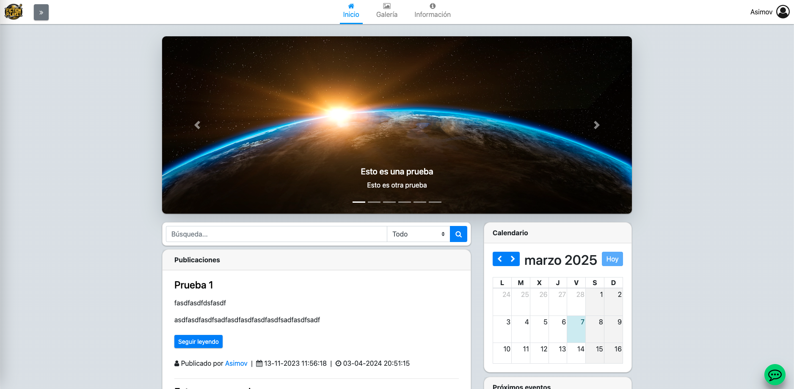
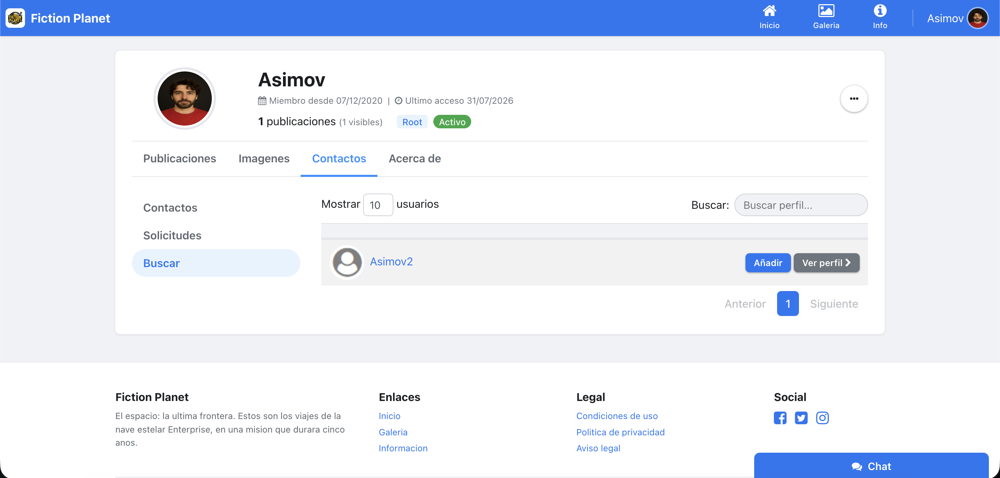
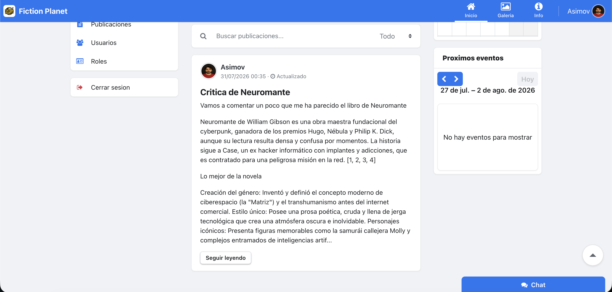
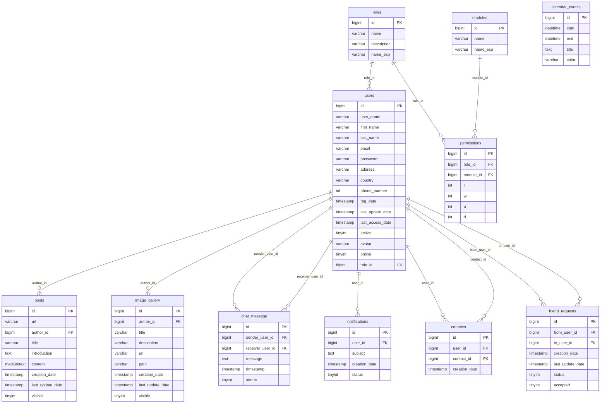

# php-mvc-social-network


## Indice

- [php-mvc-social-network](#php-mvc-social-network)
  - [Indice](#indice)
  - [Descripcion del Proyecto](#descripcion-del-proyecto)
  - [Capturas de Pantalla](#capturas-de-pantalla)
    - [Pagina de Inicio](#pagina-de-inicio)
    - [Perfil de Usuario](#perfil-de-usuario)
    - [Publicaciones](#publicaciones)
    - [Chat en Vivo](#chat-en-vivo)
  - [Aspectos Tecnicos](#aspectos-tecnicos)
  - [Funcionalidades](#funcionalidades)
  - [Estructura del Proyecto](#estructura-del-proyecto)
  - [Modelo de Datos](#modelo-de-datos)
  - [Requisitos del Sistema](#requisitos-del-sistema)
  - [Instalacion](#instalacion)
    - [Usando Docker (recomendado)](#usando-docker-recomendado)
    - [Usando XAMPP](#usando-xampp)
    - [Solución de problemas comunes](#solución-de-problemas-comunes)
    - [Verificación de la instalación](#verificación-de-la-instalación)
    - [Próximos pasos](#próximos-pasos)
  - [Configuracion](#configuracion)
    - [Configuracion basica](#configuracion-basica)
    - [Configuración de servidor virtual (opcional)](#configuración-de-servidor-virtual-opcional)
  - [Primeros pasos para desarrolladores](#primeros-pasos-para-desarrolladores)
    - [Flujo de trabajo recomendado](#flujo-de-trabajo-recomendado)
    - [Convenciones de código](#convenciones-de-código)
    - [Consejos para extender la aplicación](#consejos-para-extender-la-aplicación)
  - [Seguridad Implementada](#seguridad-implementada)

## Descripcion del Proyecto

El proyecto php-mvc-social-network (Fiction Planet) es una red social completa construida desde cero con PHP 8.1, MySQL y jQuery. Implementa un framework MVC propio con Front Controller, patrón DAO para abstracción de base de datos, sistema de permisos RBAC granular, mensajería instantánea, galería de imágenes, calendario de eventos y un panel de administración de usuarios y roles.

El proyecto no tiene dependencias externas de frameworks PHP — todo el núcleo (enrutamiento, sesiones, validación, conexión a base de datos, manejo de errores) está implementado manualmente, lo que demuestra comprensión profunda de los fundamentos de la arquitectura web.

## Capturas de Pantalla

### Pagina de Inicio
<p align="center">
  
</p>

### Perfil de Usuario
<p align="center">
  
</p>

### Publicaciones
<p align="center">
  
</p>

### Chat en Vivo
<p align="center">
  
</p>

## Aspectos Tecnicos

La aplicación ha sido diseñada siguiendo principios robustos de ingeniería de software:

- **Diagrama de Arquitectura**:

  Este diagrama muestra la interacción entre los componentes principales del sistema:

  ```mermaid
  flowchart TB
    subgraph Cliente
      Browser["Navegador"]
    end
    
    subgraph Servidor["Servidor PHP"]
      FrontController["FrontController\nindex.php + App.php"]
      
      subgraph MVC["Patrón MVC"]
        direction TB
        Controllers["Controladores\n/controllers/*.php"]
        Models["Modelos\n/models/*.php"]
        Views["Vistas\n/views/*.php"]
      end
      
      subgraph DAOs["Capa de Acceso a Datos"]
        direction LR
        ModelDAOs["DAOs\n/models/dao/*.php"]
        Connection["Connection.php"]
      end
      
      subgraph Otros["Componentes de Soporte"]
        direction TB
        Session["Session.php"]
        Validators["Validadores\n/libs/validators/*.php"]
        Templates["Plantillas\n/templates/*.inc.php"]
      end
    end
    
    subgraph BaseDatos["Base de Datos"]
      MySQL[("MySQL/MariaDB")]
    end
    
    %% Conexiones principales
    Browser <--"HTTP Request"--> FrontController
    FrontController --> Controllers
    Controllers --> Models
    Controllers --> Views
    Views --> Browser
    Models --> ModelDAOs
    ModelDAOs <--> Connection
    Connection <--> MySQL
    
    %% Conexiones secundarias
    Controllers --> Session
    Controllers --> Validators
    Views --> Templates
    
    %% Estilos
    classDef primary fill:#d0e0ff,stroke:#0066cc,stroke-width:2px
    classDef secondary fill:#e6f5e6,stroke:#339933,stroke-width:2px
    classDef database fill:#ffe6cc,stroke:#ff9933,stroke-width:2px
    classDef client fill:#f5e6ff,stroke:#9933cc,stroke-width:2px
    
    class Browser client
    class FrontController,Controllers,Models,Views primary
    class ModelDAOs,Connection secondary
    class MySQL database
    class Session,Validators,Templates secondary
  ```

  El flujo de una solicitud típica:
  1. El navegador envía una petición HTTP
  2. El FrontController (index.php + App.php) analiza la URL y determina qué controlador y método invocar
  3. El controlador procesa la solicitud, interactúa con los modelos para obtener/manipular datos
  4. Los modelos utilizan DAOs para acceder a la base de datos
  5. El controlador prepara los datos y los pasa a la vista
  6. La vista renderiza la respuesta HTML utilizando plantillas
  7. La respuesta se envía de vuelta al navegador

  Este patrón de arquitectura asegura:
  - **Separación de responsabilidades**: Cada componente tiene una función específica
  - **Mantenibilidad**: Facilita cambios en componentes individuales sin afectar a otros
  - **Testabilidad**: Permite probar cada capa de forma independiente
  - **Escalabilidad**: Facilita la adición de nuevas funcionalidades

- **Arquitectura MVC**: Implementación completa del patrón Modelo-Vista-Controlador para separar la lógica de negocio de su visualización.
  - **Controladores**: Clases PHP que reciben las peticiones HTTP desde el Front Controller (index.php), extraen parámetros de la URL, validan permisos de usuario y orquestan la ejecución de la lógica de negocio.
    - Cada controlador hereda de la clase base `Controller` que proporciona funcionalidades comunes
    - Se instancian dinámicamente según la URL solicitada (ej: `/users/profile` invoca `Users::profile()`)
    - Preparan datos para las vistas a través de arrays asociativos
  
  - **Modelos**: Implementan entidades del negocio como clases PHP con propiedades privadas y métodos getter/setter.
    - Representan objetos del dominio (Usuario, Publicación, Mensaje, etc.)
    - Encapsulan la lógica de validación específica de entidades
    - Proporcionan independencia de la capa de persistencia
  
  - **Vistas**: Archivos PHP con HTML que reciben datos procesados de los controladores.
    - Utilizan plantillas reutilizables para elementos comunes (header, footer, modales)
    - Incorporan scripts JavaScript para funcionalidades dinámicas
    - Se renderizan a través del método `render()` de la clase `View`

- **Sistema de Enrutamiento**: Implementación del patrón Front Controller para gestionar todas las peticiones HTTP:

  - **Componentes principales**:
    - `index.php`: Front Controller que inicia la aplicación y actúa como punto de entrada único para todas las peticiones
    - `App.php`: Analizador de URL y despachador de controladores
    - `.htaccess`: Configuración de Apache para redireccionar todas las peticiones al Front Controller
  
  - **Proceso de enrutamiento**:
    1. Todas las peticiones son redirigidas a `index.php` mediante reglas en `.htaccess`
    2. El Front Controller carga la configuración y crea una instancia de `App`
    3. `App.php` analiza la URL siguiendo la estructura `/controlador/metodo/parametros`
    4. Extrae el nombre del controlador y lo convierte en CamelCase
    5. Busca y carga el archivo correspondiente en el directorio `controllers/`
    6. Instancia el controlador y ejecuta el método solicitado con los parámetros extraídos
    7. Si el controlador o método no existen, renderiza una página de error 404
    
    **Implementación en código**:
    
    ```php
    // 1. Extracción de la URL
    $url = !empty($_GET['url']) ? $_GET['url'] : 'home/home';
    $url = rtrim($url, '/');
    $arrUrl = explode('/', $url);
    
    // 2. Determinación del controlador
    $controller = $arrUrl[0]; 
    $controller = ucwords($controller); // Primera letra mayúscula
    $controllerFile = CONTROLLERS_PATH . $controller . '.php';
    
    // 3. Determinación del método
    $method = $arrUrl[0]; // Por defecto, mismo nombre que el controlador
    if(!empty($arrUrl[1])) {
        $method = $arrUrl[1]; // Si hay un segundo segmento
    }
    
    // 4. Extracción de parámetros
    $params = '';
    if(!empty($arrUrl[2])) {
        for ($i = 2; $i < count($arrUrl); $i++) {
            $params .= $arrUrl[$i].',';
        }
        $params = trim($params,',');
    }
    
    // 5. Instanciación y ejecución del controlador
    if(file_exists($controllerFile)) {
        require_once $controllerFile;
        $controller = new $controller();
        
        if(method_exists($controller, $method)) {
            $controller->{$method}($params);
        } else {
            $fault = new Fault();
            $fault->error_404();
        }
    }
    ```
  
  - **Ejemplo de flujo completo**:
    - URL solicitada: `example.com/users/profile/42`
    - Análisis: Controlador=`Users`, Método=`profile`, Parámetro=`42`
    - Proceso:
      1. Se carga `controllers/Users.php`
      2. Se crea una instancia: `$users = new Users()`
      3. Se ejecuta: `$users->profile('42')`
      4. El controlador obtiene datos del modelo: `UserDAO::get_user_by_id()`
      5. Se renderiza la vista: `$this->view->render($this, 'profile', $data)`

  - **Sistema de generación de URLs**:
    - La aplicación utiliza constantes predefinidas en `config.inc.php` para generar URLs consistentes:
    ```php
    // Definición de rutas base
    define('USERS', 'users');
    define('PROFILE', USERS . '/profile');
    
    // URLs completas para SEO
    define('USERS_SEO_URL', BASE_URL . USERS);
    define('PROFILE_SEO_URL', BASE_URL . PROFILE);
    ```
    
    - Uso en el código para redirecciones y enlaces:
    ```php
    // Redirección a perfil de usuario
    Redirection::redirect(PROFILE_SEO_URL . '/' . $userId);
    
    // Generación de URL en vistas
    <a href="<?php echo PROFILE_SEO_URL . '/' . $user->get_id(); ?>">Ver perfil</a>
    ```

  - **Características y ventajas**:
    - **Simplicidad**: Sistema basado en convenciones sin configuración compleja de rutas
    - **Predecible**: Estructura uniforme `/controlador/metodo/parametros`
    - **Mantenible**: Fácil localización de archivos y responsabilidades
    - **SEO-friendly**: URLs amigables y legibles
    - **Seguridad**: Gestión centralizada de errores y validación de parámetros
    - **Extensible**: Posibilidad de añadir nuevos controladores sin modificar el enrutador

- **Patrón DAO**: La aplicación implementa Data Access Objects para abstraer completamente las operaciones de base de datos:
  - Cada entidad tiene su correspondiente clase DAO (ej: `UserDAO`, `PostDAO`)
  - Las operaciones CRUD se encapsulan en métodos estáticos
  - Uso de consultas preparadas con PDO para prevenir SQL Injection
  - Conversión automática entre resultados de consultas y objetos modelo
  - Ejemplo de flujo: `Controller -> Model -> DAO -> Database -> DAO -> Model -> Controller -> View`

- **Gestión de Sesiones**:
  - Clase `Session` que encapsula la gestión de $_SESSION
  - Almacenamiento seguro de información de usuario loggeado
  - Control de timeout y regeneración de ID de sesión
  - Almacenamiento de permisos de usuario para acceso rápido

- **Sistema de Validación**:
  - Clases validadoras específicas para cada formulario importante
  - Validación tanto del lado del cliente (JavaScript) como del servidor (PHP)
  - Mensajes de error contextuales y específicos para cada campo
  - Reutilización de validaciones entre operaciones similares

- **Conexión a Base de Datos**:
  - Clase `Connection` que implementa el patrón Singleton
  - Gestión de conexiones PDO con manejo de errores
  - Métodos para abrir/cerrar conexiones y transacciones
  - Configuración centralizada en config.inc.php

## Funcionalidades

FictionPlanet implementa un conjunto completo de funcionalidades que emulan una red social moderna:

- **Sistema de Usuarios**:
  - Registro y autenticacion segura de usuarios
  - Perfiles personalizables con avatar, datos personales y configuracion
  - Panel de administracion de usuarios (activar/desactivar, cambiar roles)

- **Control de Acceso**:
  - Sistema de roles predefinidos (Root, Administrador, Usuario registrado)
  - Permisos granulares por módulo (CRUD - Create, Read, Update, Delete)
  - Control de acceso a nivel de controlador y vista

- **Publicaciones y Contenido**:
  - Editor enriquecido para crear y editar publicaciones
  - Soporte para contenido multimedia (imágenes y archivos adjuntos)
  - Gestión de visibilidad de publicaciones
  - Sistema de paginación para listar publicaciones

- **Comunicacion entre Usuarios**:
  - Sistema de solicitudes de amistad (enviar, aceptar, rechazar)
  - Lista de contactos/amigos
  - Mensajeria instantanea entre usuarios

- **Galería de Imágenes**:
  - Carga y gestión de imágenes personales
  - Organización por colecciones/álbumes
  - Visualización optimizada de imágenes

- **Calendario de Eventos**:
  - Visualización de eventos en formato calendario
  - Creación y edición de eventos con fechas, títulos y códigos de color
  - Vista de calendario mensual y semanal

- **Búsqueda y Filtrado**:
  - Búsqueda global de contenidos
  - Filtros avanzados por tipo de contenido (usuarios, publicaciones, imágenes)
  - Criterios de búsqueda específicos (título, autor, contenido, fecha)

- **Interfaz Adaptativa**:
  - Diseño responsive optimizado para dispositivos móviles y escritorio
  - Navegación intuitiva con menús contextuales
  - Carrusel de imágenes destacadas en la página principal

## Estructura del Proyecto

```
php-mvc-social-network/
├── controllers/          # Controladores MVC
│   ├── About_us.php      # Pagina de informacion sobre el proyecto
│   ├── Calendar.php      # Gestion de eventos de calendario
│   ├── Fault.php         # Gestion de errores HTTP
│   ├── Home.php          # Controlador de pagina principal
│   ├── Image_gallery.php # Gestion de galerias de imagenes
│   ├── Instant_messaging.php # Sistema de chat en vivo
│   ├── Login.php         # Autenticacion de usuarios
│   ├── Posts.php         # Gestion de publicaciones
│   ├── Roles.php         # Administracion de roles y permisos
│   └── Users.php         # Gestion de usuarios y perfiles
├── doc/                  # Documentación del proyecto
│   └── images/           # Capturas de pantalla para documentación
├── libs/                 # Bibliotecas y utilidades
│   ├── core/             # Núcleo de la aplicación
│   │   ├── App.php       # Clase principal de la aplicación (Front Controller)
│   │   ├── Connection.php # Gestión de conexiones a base de datos
│   │   ├── Controller.php # Clase base para controladores
│   │   ├── Redirection.php # Utilidad para redirecciones HTTP
│   │   ├── Utilities.php  # Funciones auxiliares
│   │   └── View.php      # Sistema de renderizado de vistas
│   ├── Session.php       # Gestión de sesiones de usuario
│   └── validators/       # Validadores de formularios
│       ├── LoginValidator.php    # Validación de credenciales
│       ├── NewPostsValidator.php # Validación para crear publicaciones
│       ├── NewUserValidator.php  # Validación para registro de usuarios
│       └── UpdatedPostsValidator.php # Validación para editar publicaciones
├── models/               # Modelos de datos
│   ├── dao/              # Data Access Objects
│   │   ├── CalendarEventsDAO.php # DAO para eventos de calendario
│   │   ├── ChatMessageDAO.php    # DAO para mensajes de chat
│   │   ├── ContactDAO.php        # DAO para contactos/amigos
│   │   ├── FriendRequestsDAO.php # DAO para solicitudes de amistad
│   │   ├── ImageGalleryDAO.php   # DAO para galería de imágenes
│   │   ├── ModuleDAO.php         # DAO para módulos del sistema
│   │   ├── PermissionDAO.php     # DAO para permisos
│   │   ├── PostDAO.php           # DAO para publicaciones
│   │   ├── RoleDAO.php           # DAO para roles
│   │   └── UserDAO.php           # DAO para usuarios
│   ├── CalendarEventModel.php    # Modelo para eventos de calendario
│   ├── ChatMessageModel.php      # Modelo para mensajes de chat
│   ├── ContactModel.php          # Modelo para contactos/amigos
│   ├── FriendRequestsModel.php   # Modelo para solicitudes de amistad
│   ├── ImageGalleryModel.php     # Modelo para galería de imágenes
│   ├── ModuleModel.php           # Modelo para módulos del sistema
│   ├── PermissionModel.php       # Modelo para permisos
│   ├── PostModel.php             # Modelo para publicaciones
│   ├── RoleModel.php             # Modelo para roles
│   └── UserModel.php             # Modelo para usuarios
├── plugins/              # Plugins y extensiones de terceros
├── static/               # Recursos estaticos
│   ├── css/              # Hojas de estilo
│   ├── img/              # Imágenes estáticas (logos, iconos, fondos)
│   └── js/               # Scripts JavaScript
│       ├── plugins/      # Bibliotecas JavaScript de terceros
│       ├── bootstrap.bundle.min.js # Framework Bootstrap
│       ├── chatFunctions.js     # Funcionalidades del chat
│       ├── fileInput.js         # Manejo de carga de archivos
│       ├── imageGalleryFunctions.js # Funcionalidades de galería
│       ├── jquery-3.5.1.js      # Biblioteca jQuery
│       ├── main.js              # Script principal
│       ├── postFunctions.js     # Funcionalidades de publicaciones
│       ├── roleFunctions.js     # Gestión de roles
│       └── userFunctions.js     # Funcionalidades de usuarios
├── templates/            # Plantillas reutilizables
│   ├── crud/             # Plantillas para operaciones CRUD
│   ├── modals/           # Ventanas modales reutilizables
│   ├── nav/              # Elementos de navegación
│   ├── chat_window.inc.php         # Ventana de chat
│   ├── create_post_empty.inc.php   # Formulario vacío para crear post
│   ├── create_post_validate.inc.php # Formulario validado para crear post
│   ├── create_user_empty.inc.php   # Formulario vacío para crear usuario
│   ├── create_user_validated.inc.php # Formulario validado para crear usuario
│   ├── footer.inc.php              # Pie de página común
│   ├── head.inc.php                # Cabecera HTML común
│   ├── image_gallery_table.inc.php # Tabla de imágenes
│   ├── post_list.inc.php           # Lista de publicaciones
│   ├── scripts.inc.php             # Carga de scripts comunes
│   ├── update_attached_files.inc.php # Gestión de archivos adjuntos
│   ├── update_post_empty.inc.php   # Formulario vacío para editar post
│   ├── update_post_validate.inc.php # Formulario validado para editar post
│   ├── user_chat_list.inc.php      # Lista de chats de usuario
│   └── user_contact_list.inc.php   # Lista de contactos de usuario
├── uploads/              # Directorio para archivos subidos
│   ├── editor/           # Archivos del editor de texto enriquecido
│   ├── gallery/          # Imágenes de la galería de usuarios
│   └── posts/            # Archivos adjuntos a publicaciones
├── views/                # Vistas de la aplicación
│   ├── about_us/         # Vistas de información sobre el proyecto
│   ├── fault/            # Vistas de páginas de error
│   ├── image_gallery/    # Vistas de galería de imágenes
│   ├── login/            # Vistas de inicio de sesión
│   ├── posts/            # Vistas de publicaciones
│   │   ├── create_post.php  # Vista para crear publicación
│   │   ├── post.php         # Vista para mostrar publicación
│   │   ├── posts.php        # Vista para listar publicaciones
│   │   └── update_post.php  # Vista para editar publicación
│   ├── roles/            # Vistas de administración de roles
│   ├── users/            # Vistas de gestión de usuarios
│   │   ├── create_user.php        # Vista para crear usuario
│   │   ├── profile.php            # Vista de perfil de usuario
│   │   ├── profile_inactive.php   # Vista para usuario inactivo
│   │   ├── profile_not_logged_in.php # Vista para perfil sin sesión
│   │   └── users.php              # Vista para listar usuarios
│   └── home.php          # Vista de la página principal
├── .htaccess             # Configuración de Apache para URLs amigables
├── config.inc.php        # Configuración general de la aplicación
├── fictionplanetdb.sql   # Script de base de datos
├── index.php             # Punto de entrada de la aplicacion (Front Controller)
└── README.md             # Este archivo
```

## Modelo de Datos

El siguiente diagrama entidad-relación representa la estructura de la base de datos utilizada por FictionPlanet:



## Requisitos del Sistema

- PHP 8.1.1 o superior
- MySQL 5.7 o superior / MariaDB 10.4.21
- Servidor web Apache con mod_rewrite habilitado
- XAMPP 8.1.1+ (incluye PHP 8.1.1, MariaDB 10.4.21, Apache)
- Extensiones PHP requeridas:
  - PDO y PDO_MySQL para conexión a base de datos
  - GD Library para manipulación de imágenes
  - JSON para procesamiento de datos
  - mbstring para soporte de codificación UTF-8
- Navegador web moderno (Chrome, Firefox, Edge, Safari)

## Instalacion

### Usando Docker (recomendado)

```bash
git clone https://github.com/RGiskard7/fiction-planet-web.git
cd fiction-planet-web
bash docker/setup.sh
# Abrir http://localhost:8080
# Login: Asimov / 1234 (Root) o Asimov2 / 1234 (Admin)
```

### Usando XAMPP

XAMPP es un paquete que incluye Apache, MySQL/MariaDB, PHP y phpMyAdmin, lo que facilita la configuración del entorno necesario para ejecutar FictionPlanet.

1. **Instalar XAMPP**:
   - Descargar XAMPP desde [https://www.apachefriends.org/](https://www.apachefriends.org/) (versión 8.1.1 o superior)
   - Ejecutar el instalador:
     - **Windows**: Ejecutar el archivo `.exe` descargado y seguir las instrucciones
     - **macOS**: Montar el archivo `.dmg` y arrastrar XAMPP a la carpeta de aplicaciones
     - **Linux**: Hacer ejecutable el archivo `.run` descargado (`chmod +x`) y ejecutarlo

2. **Iniciar XAMPP Control Panel**:
   - **Windows**: Ejecutar XAMPP Control Panel desde el menú inicio o el acceso directo
   - **macOS**: Abrir la aplicación "manager-osx" en la carpeta de XAMPP
   - **Linux**: Ejecutar `sudo /opt/lampp/lampp start` o usar el panel de control gráfico

3. **Iniciar los servicios necesarios**:
   - Hacer clic en "Start" para Apache (servidor web)
   - Hacer clic en "Start" para MySQL (base de datos)
   - Verificar que ambos servicios muestren el estado "Running" (verde)

4. **Clonar o descargar el repositorio**:
   - **Opción 1 - Usando Git**:
     - Navegar a la carpeta `htdocs` de XAMPP:
       - Windows: `C:\xampp\htdocs\`
       - macOS: `/Applications/XAMPP/htdocs/`
       - Linux: `/opt/lampp/htdocs/`
     - Abrir una terminal en esa ubicación y ejecutar:
       ```bash
       git clone https://github.com/RGiskard7/FictionPlanet-Web.git
       ```
   
   - **Opción 2 - Descarga directa**:
     - Descargar el ZIP del repositorio desde GitHub
     - Extraer el contenido en la carpeta `htdocs` de XAMPP
     - Renombrar la carpeta extraída a `FictionPlanet-Web` si es necesario

5. **Configurar la base de datos con phpMyAdmin**:
   
   - **Acceder a phpMyAdmin**:
     - Abrir el navegador web y navegar a: `http://localhost/phpmyadmin/`
     - Si aparece una pantalla de login, el usuario por defecto es `root` sin contraseña

   - **Crear la base de datos**:
     - En el panel izquierdo de phpMyAdmin, hacer clic en "Nueva"
     - Introducir `fictionplanetdb` como nombre de la base de datos
     - Seleccionar `utf8mb4_general_ci` como collation
     - Hacer clic en "Crear"

   - **Importar el archivo SQL**:
     - Seleccionar la base de datos `fictionplanetdb` recién creada
     - Hacer clic en la pestaña "Importar" en el menú superior
     - Hacer clic en "Examinar" y seleccionar el archivo `fictionplanetdb.sql` del proyecto
     - Desplazarse hacia abajo y hacer clic en "Continuar"
     - Esperar a que se complete la importación (aparecerá un mensaje de éxito)

6. **Configurar la aplicacion** (ver detalles en la seccion de Configuracion):
   - Copia `.env.example` a `.env` y edita las credenciales de base de datos

7. **Configurar permisos de directorios**:
   - **Windows**:
     - Hacer clic derecho en la carpeta `uploads` dentro del proyecto
     - Seleccionar "Propiedades" → "Seguridad" → "Editar"
     - Asegurarse que IUSR o el usuario del servidor web tiene permisos de escritura
   
   - **macOS/Linux**:
     - Abrir terminal y navegar al directorio del proyecto
     - Ejecutar:
       ```bash
       chmod 755 -R ./
       chmod 777 -R ./uploads
       ```

8. **Verificar configuración de Apache**:
   - **Para módulo rewrite**:
     - Abrir `httpd.conf` desde el panel de XAMPP (botón "Config" junto a Apache)
     - Buscar la línea `LoadModule rewrite_module modules/mod_rewrite.so`
     - Asegurarse que NO esté comentada (no tiene # al inicio)
     - Si hiciste cambios, reiniciar Apache desde el panel de control

9. **Acceder a la aplicación** (Ver sección "Verificación de la instalación" más abajo)

### Solución de problemas comunes

- **Error "No se puede conectar a la base de datos"**:
  - Verificar que el servicio MySQL este corriendo en el panel de XAMPP
  - Comprobar que el nombre de la base de datos sea `fictionplanetdb`
  - Verificar credenciales en el archivo `.env`

- **Error 404 o pagina en blanco**:
  - Verificar que Apache este corriendo en el panel de XAMPP
  - Comprobar que mod_rewrite este habilitado
  - Verificar que `APP_URL` en `.env` coincida con la URL de acceso

- **Error de permisos al subir archivos**:
  - Asegurarse que la carpeta `uploads` y sus subcarpetas tengan permisos de escritura
  - Verificar límites de tamaño de archivo en la configuración de PHP

### Verificación de la instalación

Para comprobar que la instalación ha sido exitosa:

1. **Acceder a la página principal**:
   - Abrir un navegador y navegar a: `http://localhost/FictionPlanet-Web/`
   - Deberías ver la página de inicio con el carrusel de imágenes y la lista de publicaciones

2. **Verificar el acceso al sistema**:
   - Hacer clic en el botón "Iniciar sesión" en la barra de navegación
   - Acceder con las credenciales por defecto:
     - Usuario: `Asimov`
     - Contraseña: `1234`
   - Deberías ver tu nombre de usuario en la barra de navegación y tener acceso a tu perfil

3. **Comprobar funcionalidades básicas**:
   - Visitar tu perfil de usuario
   - Ver las publicaciones existentes
   - Acceder al chat (si hay otros usuarios)
   - Verificar la galería de imágenes

4. **Verificación de la base de datos**:
   - En phpMyAdmin, verificar que todas las tablas se hayan importado correctamente
   - Comprobar que existan datos en las tablas principales: `users`, `roles`, `modules`, `permissions`

Si alguno de estos pasos falla, revisa la sección "Solución de problemas comunes" o los registros de error en `php-error.log`.

### Próximos pasos

Una vez que el sistema esté funcionando correctamente, puedes comenzar a explorar:

1. **Conocer la plataforma**:
   - Explora las publicaciones existentes
   - Revisa los perfiles de los usuarios de ejemplo
   - Familiarízate con la interfaz de usuario

2. **Personalización**:
   - Edita tu perfil de usuario
   - Crea una publicación de prueba
   - Sube imágenes a tu galería
   - Prueba el sistema de mensajería

3. **Administración** (si tienes permisos de administrador):
   - Crea nuevos usuarios
   - Administra los roles y permisos
   - Modera el contenido de las publicaciones

4. **Desarrollo**:
   - Revisa la sección "Primeros pasos para desarrolladores"
   - Examina la estructura del código fuente
   - Considera qué mejoras o características adicionales podrías implementar

## Configuracion

Para personalizar la configuracion de la aplicacion, edita el archivo `.env` en la raiz del proyecto. Las variables disponibles son:

```bash
DB_TYPE=mysql
DB_HOST=localhost
DB_USER=root
DB_PASSWORD=
DB_NAME=fictionplanetdb
DB_CHARSET=utf8mb4

APP_URL=http://localhost
APP_DEBUG=false
```

### Configuracion basica

1. **Parametros obligatorios** (deben modificarse segun tu entorno):
   - `DB_HOST`, `DB_USER`, `DB_PASSWORD`, `DB_NAME`: Credenciales de la base de datos
   - `APP_URL`: URL base de la aplicacion (ej: `http://localhost:8080` para Docker)

2. **Parametros que normalmente no requieren cambios** (en entorno XAMPP estandar):
   - `DB_HOST`: Normalmente `localhost`
   - `DB_USER`: `root` en instalaciones por defecto de XAMPP
   - `DB_PASSWORD`: Vacio en instalaciones por defecto de XAMPP
   - `DB_NAME`: `fictionplanetdb` (debe coincidir con el nombre de la base de datos creada)

3. **Nota de seguridad**:
   - Para entornos de produccion, es fundamental cambiar las credenciales por defecto
   - Nunca utilizar usuario `root` sin contrasena en un servidor publico
   - Considerar el uso de HTTPS para proteger la informacion transmitida

### Configuración de servidor virtual (opcional)

Para una experiencia mejorada, puedes configurar un host virtual en Apache:

1. Editar el archivo `httpd-vhosts.conf` en `xampp/apache/conf/extra/`
2. Añadir la siguiente configuración:

```apache
<VirtualHost *:80>
    ServerName fictionplanet.local
    DocumentRoot "C:/xampp/htdocs/FictionPlanet-Web"
    <Directory "C:/xampp/htdocs/FictionPlanet-Web">
        Options Indexes FollowSymLinks
        AllowOverride All
        Require all granted
    </Directory>
</VirtualHost>
```

3. Editar el archivo `hosts` del sistema:
   - Windows: `C:\Windows\System32\drivers\etc\hosts`
   - macOS/Linux: `/etc/hosts`

4. Añadir la siguiente línea:
```
127.0.0.1 fictionplanet.local
```

5. Reiniciar Apache desde el panel de control de XAMPP
6. Acceder a la aplicación a través de `http://fictionplanet.local/`

## Primeros pasos para desarrolladores

Si deseas modificar o extender el proyecto, esta guía te ayudará a entender cómo trabajar con la arquitectura existente.

### Flujo de trabajo recomendado

1. **Familiarízate con la estructura del proyecto**:
   - Comienza explorando los archivos en este orden: `index.php` → `libs/core/App.php` → `controllers/` → `models/` → `views/`
   - Examina cómo se implementa un módulo completo (por ejemplo, Posts o Users)
   - Entiende el flujo de datos desde la solicitud HTTP hasta la respuesta renderizada

2. **Configuración del entorno de desarrollo**:
   - Configura un host virtual para desarrollo (explicado arriba)
   - Habilita la visualización de errores PHP para desarrollo:
     ```php
     // En config.inc.php o en un archivo separado para dev
     ini_set('display_errors', 1);
     ini_set('display_startup_errors', 1);
     error_reporting(E_ALL);
     ```

3. **Implementar nueva funcionalidad**:

   - **Añadir un nuevo controlador**:
     1. Crear archivo `controllers/NuevoControlador.php`:
        ```php
        <?php
        require_once MODELS_PATH . "MiModelo.php";
        require_once DAO_PATH . "MiModeloDAO.php";

        class NuevoControlador extends Controller {
            public function nuevoControlador() {
                // Método por defecto (mismo nombre que el controlador)
                $data['pageTitle'] = 'Mi Nueva Página | Fiction Planet';
                $this->view->render($this, 'mi_vista', $data);
            }
            
            public function miMetodo($parametros = null) {
                // Verificar permisos
                if (!Session::is_started() || !$_SESSION['permissions'][MI_MODULO]['r']) {
                    Redirection::redirect(BASE_URL);
                }
                
                // Procesar datos
                // ...
                
                // Renderizar vista
                $this->view->render($this, 'mi_otra_vista', $data);
            }
        }
        ```
   
   - **Crear un nuevo modelo y DAO**:
     1. Crear el modelo `models/MiModelo.php`:
        ```php
        <?php
        class MiModelo {
            private $id;
            private $propiedad1;
            private $propiedad2;
            // ...
            
            public function __construct($id, $propiedad1, $propiedad2, /* ... */) {
                $this->id = $id;
                $this->propiedad1 = $propiedad1;
                $this->propiedad2 = $propiedad2;
                // ...
            }
            
            // Getters y setters
            public function get_id() {
                return $this->id;
            }
            
            public function get_propiedad1() {
                return $this->propiedad1;
            }
            
            public function set_propiedad1($propiedad1) {
                $this->propiedad1 = $propiedad1;
            }
            
            // ... más getters y setters
        }
        ```
     
     2. Crear el DAO `models/dao/MiModeloDAO.php`:
        ```php
        <?php
        require_once MODELS_PATH . "MiModelo.php";
        
        class MiModeloDAO {
            private static function fetch_items(PDOStatement $queryResult) {
                $itemArray = array();
                while ($record = $queryResult->fetch(PDO::FETCH_ASSOC)) {
                    if (empty($record)) {
                        $itemArray = null;
                        break;
                    }
                    
                    $object = new MiModelo(
                        $record["id"], 
                        $record["propiedad1"], 
                        $record["propiedad2"],
                        // ...
                    );
                    
                    $itemArray[] = $object;
                }
                return $itemArray;
            }
            
            public static function get_all($connection) {
                $itemArray = null;
                
                if (isset($connection)) {
                    try {
                        $sentence = $connection->prepare("SELECT * FROM mi_tabla");
                        $sentence->execute();
                        $itemArray = self::fetch_items($sentence);
                    } catch (PDOException $e) {
                        throw new AppException("Database error: " . $e->getMessage(), 500, $e);
                    }
                }
                
                return $itemArray;
            }
            
            // Más métodos CRUD...
        }
        ```
   
   - **Crear vistas**:
     1. Crear directorio `views/nuevo_controlador/`
     2. Crear vista `views/nuevo_controlador/mi_vista.php`:
        ```php
        <?php
        $pageTitle = $data['pageTitle'];
        // Obtener más datos del array $data
        
        include TEMPLATES_PATH . 'head.inc.php';
        ?>

        <div class="container mt-5">
            <div class="row">
                <div class="col-12">
                    <div class="card">
                        <div class="card-header">
                            <h1>Mi Nueva Funcionalidad</h1>
                        </div>
                        <div class="card-body">
                            <!-- Contenido de la vista -->
                        </div>
                    </div>
                </div>
            </div>
        </div>

        <?php include TEMPLATES_PATH . 'footer.inc.php'; ?>
        ```

   - **Añadir rutas y URLs amigables**:
     1. Editar `config.inc.php` para añadir nuevas constantes de ruta:
        ```php
        // Nuevas rutas
        define('MI_CONTROLADOR', 'nuevo_controlador');
        define('MI_METODO', MI_CONTROLADOR . '/mi_metodo');
        
        // URLs completas
        define('MI_CONTROLADOR_SEO_URL', BASE_URL . MI_CONTROLADOR);
        define('MI_METODO_SEO_URL', BASE_URL . MI_METODO);
        ```

### Convenciones de código

Para mantener la coherencia con el proyecto existente, sigue estas convenciones:

- **Nombres de archivos**:
  - Controladores: `PascalCase.php` (ej: `Posts.php`)
  - Modelos: `PascalCaseModel.php` (ej: `UserModel.php`)
  - DAOs: `PascalCaseDAO.php` (ej: `UserDAO.php`)
  - Vistas: `snake_case.php` (ej: `create_user.php`)

- **Nombres de clases**:
  - Usar `PascalCase` para todas las clases
  - Controladores: Nombre simple (ej: `class Posts`)
  - Modelos: Sufijo `Model` (ej: `class UserModel`)
  - DAOs: Sufijo `DAO` (ej: `class UserDAO`)

- **Métodos y variables**:
  - Usar `snake_case` para métodos (ej: `get_user_by_id()`)
  - Usar `snake_case` para propiedades y variables (ej: `$first_name`)
  - Prefijo `get_` y `set_` para getters y setters

- **Estilo de código**:
  - Indentación con 4 espacios
  - Llaves en nueva línea para clases y funciones
  - Variables de métodos con prefijo `$` (estilo PHP)

### Consejos para extender la aplicación

- **Nuevos módulos**: Para añadir un nuevo módulo funcional completo:
  1. Crear entrada en la tabla `modules` de la base de datos
  2. Asignar permisos a los roles en la tabla `permissions`
  3. Definir constantes para el módulo en `config.inc.php`
  4. Implementar controlador, modelo, DAO y vistas

- **JavaScript y AJAX**:
  - Utiliza jQuery para manipulación del DOM y AJAX
  - Coloca scripts específicos en archivos separados en `static/js/`
  - Sigue el patrón existente en `static/js/userFunctions.js` o `static/js/postFunctions.js`

- **Depuración**:
  - Utiliza `error_log()` para registrar mensajes en el archivo `php-error.log`
  - Para depurar variables, usa `error_log(print_r($variable, true))`
  - Habilita temporalmente `display_errors` para desarrollo

## Seguridad Implementada

FictionPlanet implementa diversas medidas de seguridad:

- **Almacenamiento seguro de contraseñas**:
  - Uso de `password_hash()` con algoritmo bcrypt (BCRYPT) para hash de contraseñas
  - Verificación mediante `password_verify()` para validación de credenciales
  - Sin almacenamiento de contraseñas en texto plano

- **Prevención de inyección SQL**:
  - Uso exclusivo de consultas preparadas (PDO) en todas las operaciones de base de datos
  - Parámetros con tipos explícitos (PARAM_INT, PARAM_STR, etc.)
  - Separación completa de comandos SQL y datos de usuario

- **Proteccion XSS (Cross-Site Scripting)**:
  - Sanitizacion de entradas de usuario con `htmlentities()`
  - Validacion de formatos de entrada (email, numeros de telefono, etc.)

- **Control de sesiones**:
  - Regeneración de ID de sesión después del inicio de sesión
  - Validación de sesión en cada operación sensible
  - Timeout de sesión configurable
  - Protección contra fijación de sesión

- **Sistema de Roles y Permisos (RBAC)**:

  - **Arquitectura del sistema**:
    - Implementación de **Role-Based Access Control (RBAC)** con aspectos de control de acceso basado en recursos
    - Modelo de datos en tres niveles: `usuarios ↔ roles ↔ permisos ↔ módulos`
    - Estructura de datos relacional:
      ```
      users(role_id) → roles(id) → permissions(role_id, module_id) → modules(id)
      ```
  
  - **Componentes principales**:
    - **Roles**: Perfiles predefinidos (Root, Administrador, Usuario registrado)
    - **Módulos**: Áreas funcionales del sistema (usuarios, publicaciones, chat, etc.)
    - **Permisos**: Matriz que conecta roles con módulos y define operaciones permitidas
    - **Operaciones**: Acciones CRUD (Create, Read, Update, Delete)
  
  - **Implementación en base de datos**:
    - Tabla `roles`: Define los roles disponibles
      ```sql
      CREATE TABLE roles (
        id bigint(20) UNSIGNED NOT NULL,
        name varchar(255) NOT NULL,
        description varchar(255) DEFAULT NULL,
        name_esp varchar(255) DEFAULT NULL
      )
      ```
    
    - Tabla `modules`: Define las áreas funcionales
      ```sql
      CREATE TABLE modules (
        id bigint(20) UNSIGNED NOT NULL,
        name varchar(255) NOT NULL,
        name_esp varchar(255) DEFAULT NULL
      )
      ```
    
    - Tabla `permissions`: Matriz de permisos granulares por operación CRUD
      ```sql
      CREATE TABLE permissions (
        id bigint(20) NOT NULL,
        role_id bigint(20) UNSIGNED NOT NULL,
        module_id bigint(20) UNSIGNED NOT NULL,
        r int(11) NOT NULL DEFAULT 0, -- Read
        w int(11) NOT NULL DEFAULT 0, -- Write (Create)
        u int(11) NOT NULL DEFAULT 0, -- Update
        d int(11) NOT NULL DEFAULT 0  -- Delete
      )
      ```
  
  - **Funcionamiento en tiempo de ejecución**:
    1. Durante la autenticación, se cargan los permisos del usuario en la sesión:
       ```php
       $_SESSION['permissions'][MODULE_ID]['operation'] = true/false;
       ```
    
    2. Verificación de permisos en controladores antes de cada operación:
       ```php
       // Ejemplo: verificar permiso de lectura sobre módulo de usuarios
       if (!Session::is_started() || !$_SESSION['permissions'][MDL_USERS]['r']) {
           Redirection::redirect(BASE_URL); // Redirigir si no tiene permiso
       }
       ```
    
    3. Adaptación dinámica de la interfaz según permisos:
       ```php
       // Mostrar botón de edición solo si tiene permiso
       <?php if($_SESSION['permissions'][MDL_POSTS]['u']): ?>
           <a href="<?= UPDATE_POST_SEO_URL . '/' . $post->get_id(); ?>" class="btn btn-primary">
               <i class="fa fa-edit"></i> Editar
           </a>
       <?php endif; ?>
       ```
  
  - **Gestión administrativa**:
    - Interfaz completa para administración de roles y permisos
    - Creación, modificación y eliminación de roles
    - Asignación masiva de permisos mediante matriz visual
    - Triggers de base de datos para mantener integridad (ej: reasignación automática al eliminar roles)
  
  - **Características y ventajas**:
    - **Simplicidad**: Modelo fácil de entender y mantener
    - **Rendimiento**: Permisos pre-cargados en sesión evitan consultas frecuentes
    - **Granularidad**: Control preciso por operación y módulo
    - **Seguridad en capas**: Validación tanto en backend como en frontend
    - **Escalabilidad**: Facilidad para añadir nuevos módulos y roles

- **Validación de datos**:
  - Validadores específicos para cada tipo de formulario
  - Validación tanto en cliente (JavaScript) como servidor (PHP)
  - Sanitización de todos los datos recibidos antes de procesamiento

- **Seguridad en archivos**:
  - Validación de tipos MIME para archivos subidos
  - Regeneración de nombres de archivo para evitar conflictos
  - Restricción de extensiones permitidas
  - Límites de tamaño de archivo configurable

---

<p align="center">
  Desarrollado por <a href="https://github.com/RGiskard7">RGiskard7</a>
</p>